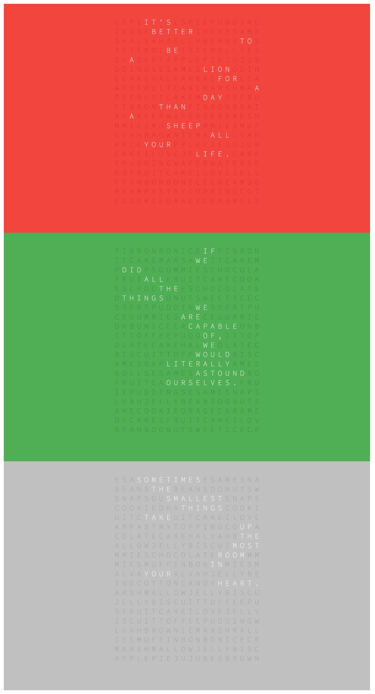
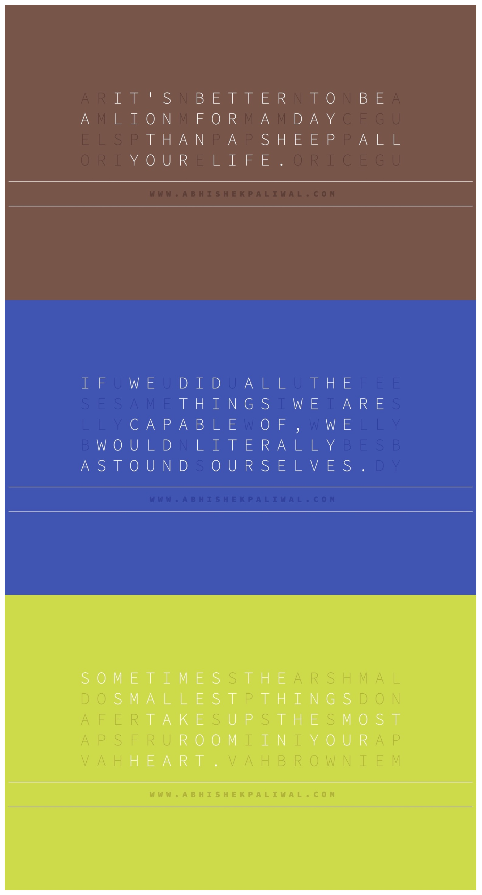

# Instructions to run these Wallpaper Bash Scripts

#### Updated: July 29, 2016 // NOTE: These scripts have dependencies on the native commands on OS X, and will produce the desired outputs on Mac OS X only.   

------------

1. Open the `_quotes.txt` file and change the text. Put one quote per line, and all uppercased.

1. ** Run command to create Type 1 wallpapers **

	```
	> sh _wallpaper_creator_type1.sh _quotes.txt
	```

2. ** Run command to create Type 2 wallpapers **

	```
	> sh _wallpaper_creator_type2.sh _quotes.txt
	```

3. ** Create PNG/JPG images automatically from the generated HTML wallpaper files from the above commands: **

	* NOTE: The following command will only work when the font files are stored locally. You might also have to edit the inline `<style>` tag in these HTML files and add the `@font-face` properties to make it work.

	```
	> sh _wkhtmltoimage_output_creator.sh
	```

-----------------

### Type 1 - HTML output screenshot (background colors are randomly generated)
[Sample HTML file - Type 1 Wallpaper](_sample_output/Type1-12-Words-Sometimes-The-Smallest-Things-Take-Up-The-Most-Room-In-Your-Heart.html)



### Type 2 - HTML output screenshot (Colors are randomly generated)
[Sample HTML file - Type 2 Wallpaper](_sample_output/Type2-12-Words-Sometimes-The-Smallest-Things-Take-Up-The-Most-Room-In-Your-Heart.html)


