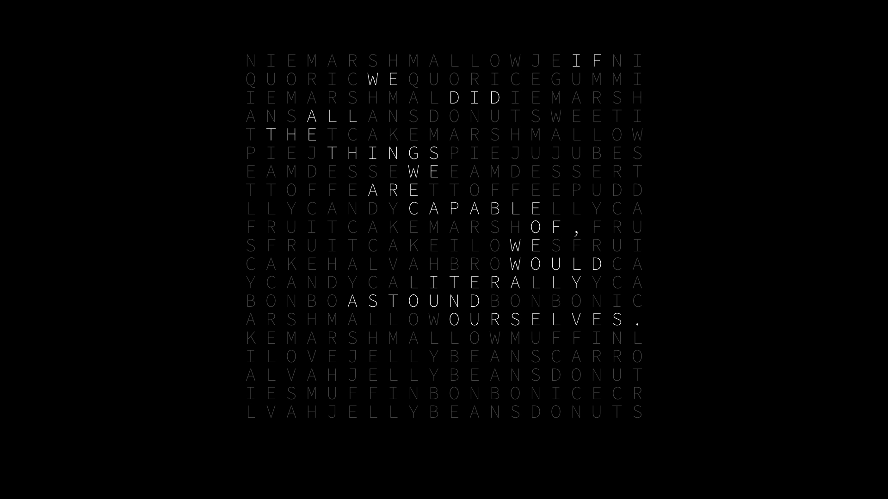
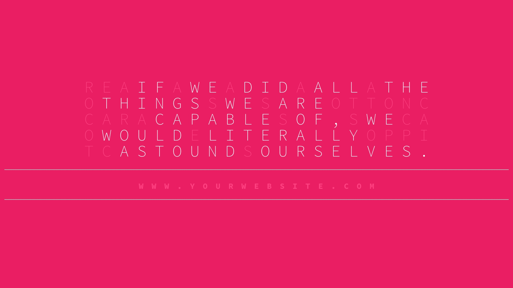
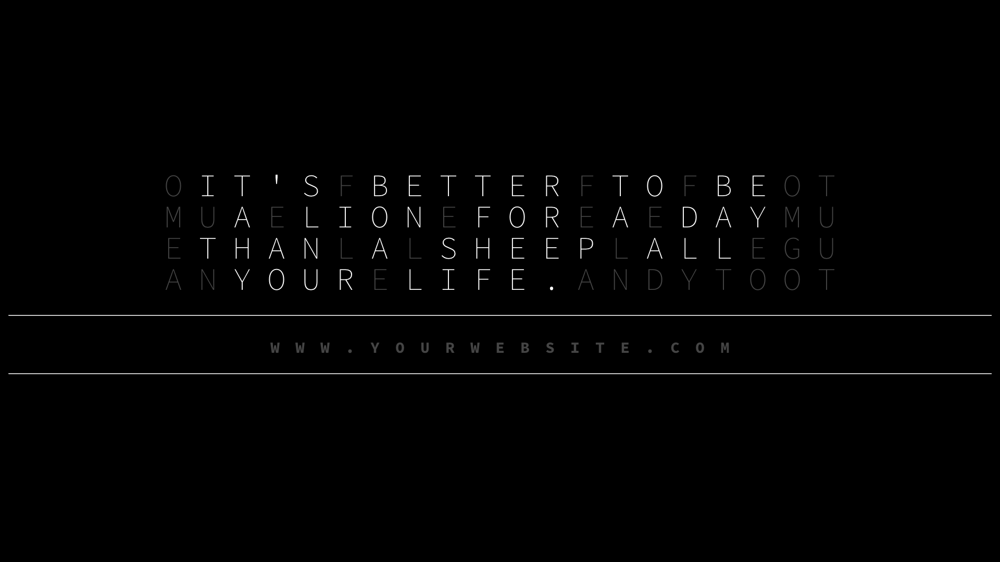

# Instructions to run these Wallpaper Bash Scripts

These wallpaper creation scripts will also create PNG/JPG images automatically from the generated HTML wallpaper files using wkhtmltoimage. You can install these dependencies by the following commands:

```bash
## Install it using homebrew on MAC OS : 
## brew install --cask wkhtmltopdf
##
## Install it using linuxbrew on Linux : 
## brew install --cask wkhtmltopdf
```

------------

1. Open the `_quotes.txt` file and change the text. Put one quote per line, and all uppercased.

2. Run command to create Type 1 wallpapers

	```bash
	bash wallpaper_creator_type1.sh _quotes.txt
	```

3. Run command to create Type 2 wallpapers

	```bash
	bash wallpaper_creator_type2.sh _quotes.txt
	```

-----------------

### Type 1 - HTML output screenshot (background colors are randomly generated)
[Sample generated HTML file - Type 1 Wallpaper](_outputs_wallpaper_creator_type1/wallpaper_creator_type1-for-quote-1-with-total-15-words.html)




### Type 2 - HTML output screenshot (Colors are randomly generated)
[Sample generated HTML file - Type 2 Wallpaper](_outputs_wallpaper_creator_type2/wallpaper_creator_type2-for-quote-1-with-total-15-words.html)






